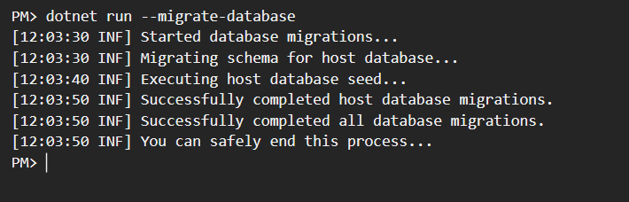
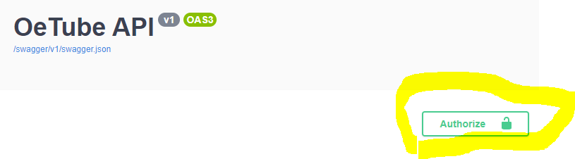
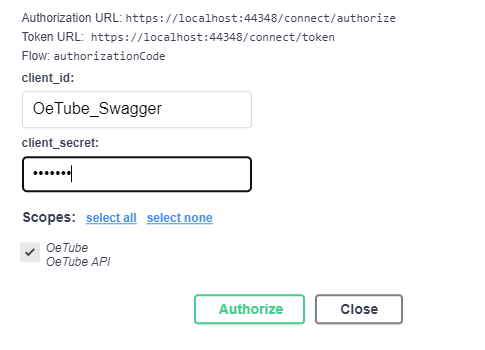
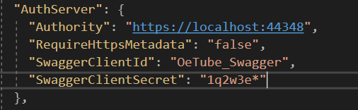
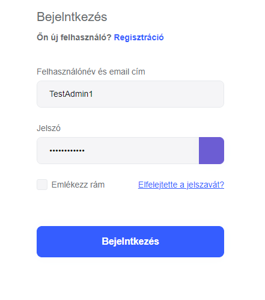
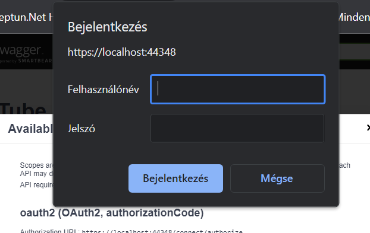
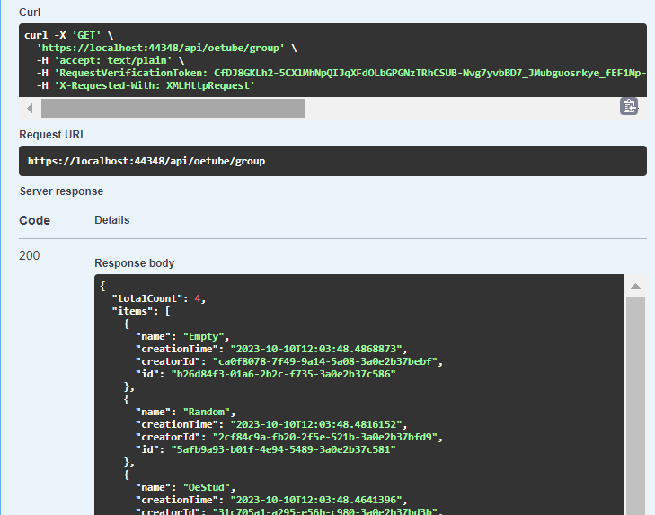

[#17](https://github.com/bprof-spec-codes/oetube/issues/17)

Szándékoztam írni egy félig kész readme-t, mert elég sok mindenbe belenyúlt a branch.

# Használat
## Seedelés
Hogy létrejöjjön az adatbázis és feltöltődjön seed adatokkal, az aspnet-core\OeTube mappában le kell futtatni ezt a konzol parancsot: 
 **dotnet run --migrate database**
 Sikeres esetben a következő kimenetet adja. 
 

### OeTubeSeedContributor.cs
OeTubeSeedContributor megvalósítja az IDataSeedContributor interfacet, amivel az ABP automatikusan regisztrálja seed forrásként és meghívja migráláskor. Következő seed adatokkal tölti fel az adatbázist:
 
 
**IdentityUser**
+ TestAdmin1
	+ Email: TestAdmin1@uni-obuda.hu
	+ Password: TestAdmin1!
	+ Role: Admin
+ TestAdmin2
	+ Email: TestAdmin2@stud.uni-obuda.hu
	+ Password: TestAdmin2! 
	+ Role: Admin
+ TestUser1
	+ Email: TestUser1@stud.uni-obuda.hu
	+ Password: TestUser1!
+ TestUser2
	+ Email: TestUser2@uni-obuda.hu
	+ Password: TestUser2!
+ TestUser3
	+ Email: TestUser3@stud.uni-obuda.hu
	+ Password: TestUser3!
+ TestUser4
	+ Email: TestUser4@gmail.com
	+ Password: TestUser4!
+ TestUser5
	+ Email: TestUser5@gmail.com
	+ Password: TestUser5!

**Group**
+ Oe
	+ Creator: TestAdmin1
	+ EmailDomains: uni-obuda.hu, stud.uni-obuda.hu
+ OeStud
	+ Creator: TestAdmin2
	+ EmailDomains: stud.uni-obuda.hu
+ Random
	+ Creator: TestUser2
	+ Members: TestUser4, TestUser5, TestUser3
+ Empty
	+ Creator: TestUser1

## Autorizáció & Autentikáció
Autorizációval védett végpontokat így lehet kipróbálni swaggerben:

 

 
Kliens kulcs az appsettings.jsonban található:
**1q2w3e***
 

 
Jó kulcs esetén átírányit az alapértelmezett bejelentkező oldalra.
 

 
Itt a TestAdmin1 - TestAdmin1! párossal jelentkeztem be, de bármelyik seedelt felhasználóval be lehet.

  Sikeres bejelentkezés után visszairányít a főoldalra és újboli bejelentkezésre kér, de felesleges, mert hibával el fog szállni.

  Mostmár hozzá lehet férni a végpontokhoz. 

# Entitások

## Video - Aggregate Root
Feltöltött videó adatai.
+ **Name**: A videó neve.
	+ Kötelező
	+ Minimális hossza: 3
	+ Maximális hossza: 100
+ **Description**: A videó leírása.
	+ Nem kötelező
	+ Nincs minimális hossza
	+ Maximális hossza: 1000 
+ **Duration**: A feltöltött videó hossza. Értékét később is meg lehet adni, de csak egyszer.
+ **State**: Videó állapota
	+ Uploading: Feltöltés alatt áll.
	+ Converting: Konvertálódik.
	+ Ready: Megtekintésre kész. 
	+ Mindig csak az utána következő állapotokba tudjuk állítani videót, visszafele nem.
	+ Ready állapotba állításkor ismertnek kell lennie a Duration-nek.

+ **Access**: Láthatósági szintje a videónak.
	+ Public: Videót bárki láthatja
	+ Private: Csak a feltöltő láthatja a videót
	+ Group: Megadott láthatósági csoportok tagjai férhetnek hozzá a videóhoz

+ **AccessGroups**: Láthatósági csoportok, amik akkor érvényesülnek, ha a felhasználó Group értéket állított be az Access-nek.
	+ AccessGroupManagerrel lehet módosítani
	+ Csak létező csoportot lehet hozzáadni
	+ Duplikált csoportokat figyelmen kívűl hagyja updatekor.
### Adatbázis konfiguráció - VideoConfiguration
+ Beállítja elsődleges kulcsnak a Video.Id-t
+ Beállítja a Video.Name-t kötelező fieldnek és a maximális hosszát 100-nak
+ Beállítja a Video.Description maximális hosszát 1000-nek
+ Meghatározza az egy a többhöz kapcsolatot a AccessGrouppal
	+ Navigációs property: Video.AccessGroups
	+ Idegen kulcs az AccessGroup oldalon: AcccessGroup.VideoId
	+ Törlődik, ha a hivatkozott Video is
+ Meghatározza a több az egyhez kapcsolatot az IdentityUserrel
	+ Idegen kulcs Playlsit oldalon: Playlsit.CreatorId
+ Beállít egy nem unique indexet a Playlist.CreationTime-ra
### Gyermek entitások konfigurációja
#### AccessGroupConfiguration
+ Beállítja az elsődleges kulcsát: AccessGroup.VideoId és AccessGroup.GroupId
+ Meghatározza a több az egyhez kapcsolatot a Grouppal
	+ Idegen kulcs az AccessGroup oldalon: AccessGroup.GroupId
	+ Törlődik, ha a hivatkozott Group is.
+ Beállít egy nem unique indexet a AccessGroup.CreationTime-ra

## Group - Aggregate Root
Ő reprezentálja a felhasználói csoportokat, amikkel testre lehet szabni a videók láthatóságát csoport láthatósági beállítás esetén.
+ **Name**: A csoport neve.
	+ Kötelező
	+ Minimális hossza: 2
	+ Maximális hossza: 100
+ **Description**: A csoport leírása.
	+ Nem kötelező
	+ Nincs minimális hossza.
	+ Maximális hossza: 1000 
+ **Members**: Tagok, akiket manuálisan adtak hozzá a csoporthoz.
	+ MemberManagerrel lehet módosítani
	+ Csak létező felhasználót lehet hozzáadni tagként
	+ Létrehozót és a duplikált felhasználókat figyelmen kívűl hagyja updatekor.
+ **EmailDomains**:
Nem csak egyenként lehet hozzáadni felhasználókat a kulcsuk alapján, hanem email tartományt is lehet definiálni.
Pl. ha a tartományok között szerepel az "xyz.abc", akkor összes olyan user, aki *@xyz.abc emaillel regisztrált, automatikusan a csoport tagjává válik.
	+ Minimális hossza: 3
	+ Maximális hossza: 255
	+ Duplikált domaineket figyelmen kívűl hagyja updatekor.
### Adatbázis konfiguráció - GroupConfiguration
+ Beállítja elsődleges kulcsnak a Group.Id-t
+ Beállítja a Group.Name-t kötelező fieldnek és a maximális hosszát 100-nak
+ Beállítja a Group.Description maximáls hosszát 1000-nek
+ Meghatározza az egy a többhöz kapcsolatot a Memberrel
	+ Navigációs property: Group.Members
	+ Idegen kulcs Member oldalon: Member.GroupId
	+ Ha a Group entitás törlődik, akkor az összes ráhivatkozó Member is.
+ Meghatározza az egy a többhöz kapcsolatot az EmailDomainnel
	+ Navigációs property: Group.EmailDomains
	+ Idegen kulcs az EmailDomain oldalon: EmailDomain.GroupId
	+ Ha a Group entitás törlődik, akkor az összes ráhivatkozó EmailDomain is.
+ Meghatározza a több az egyhez kapcsolatot az IdentityUserrel
	+ Idegen kulcs Group oldalon: Group.CreatorId
+ Beállít egy nem unique indexet a Group.CreationTime-ra
### Gyermek entitások konfigurációja
#### MemberConfiguration 
+ Beállítja az elsődleges kulcsát: Member.GroupId és a Member.UserId
+ Meghatározza a több az egyhez kapcsolatot az IdentityUserrel
	+ Idegen kulcs a Member oldalon: Member.UserId
	+ Törlődik, ha a hivatkozott User is
	+ Beállít egy nem unique indexet a Member.CreationTime-ra

#### EmailDomainConfiguration
+ Beállítja az elsődleges kulcsát: EmailDomain.GroupId és az EmailDomain.Domain
+ Beállítja az EmailDomain.Domain maximális hosszát [255]
### GroupAppService

## Playlist - Aggregate Root 
Lejátszási lista, amit a felhasználó létre tud hozni a feltöltött videóiból.
+ **Name**: A lejátszási lista neve.
	+ Kötelező
	+ Minimális hossza: 3
	+ Maximális hossza: 100
+ **Description**: A lejátszái lista leírása.
	+ Nem kötelező
	+ Nincs minimális hossza
	+ Maximális hossza: 1000 
+ **Items** : A lejátszási lista tartalma.
	+ PlaylistItemManagerrel lehet módosítani.
	+ Order a videó a pozícióját/sorrendjét tárolja.
	+ Egy videót többszőr is hozzá lehet adni, mert playlisten belül az order azonosítja egyértelműen a tételt.
	+ Csak létező videót lehet hozzáadni.
	+ A felhasználó csak a saját videóit tudja hozzáadni.

### Adatbázis konfiguráció - PlaylistConfiguration
+ Beállítja elsődleges kulcsnak a Playlist.Id-t
+ Beállítja a Playlist.Name-t kötelező fieldnek és a maximális hosszát 100-nak
+ Beállítja a Playlist.Description maximális hosszát 1000-nek
+ Meghatározza az egy a többhöz kapcsolatot a VideoItem-mel
	+ Navigációs property: Playlist.Items
	+ Idegen kulcs a VideoItem oldalon: VideoItem.PlaylistId
	+ Törlődik, ha a hivatkozott Playlist is
+ Meghatározza a több az egyhez kapcsolatot az IdentityUserrel
	+ Idegen kulcs Playlsit oldalon: Playlsit.CreatorId
+ Beállít egy nem unique indexet a Playlist.CreationTime-ra
### Gyermek entitások konfigurációja
#### VideoItemConfiguration
+ Beállítja az elsődleges kulcsát: VideoITem.PlaylistId és VideoItem.Order
+ Meghatározza a több az egyhez kapcsolatot a Videoval
	+ Idegen kulcs a VideoItem oldalon: VideoItem.VideoId
	+ Törlődik, ha a hivatkozott Video is.
+ Beállít egy nem unique indexet a VideoItem.CreationTime-ra

## OeTubeUser - AggregateRoot
OeTubeUser automatikusan hozzáadódik egy lokális eseménykezelővel(NewUserEventHandler), amikor egy felhasználó sikeresen regisztrált.
+ **Name**: A felhasználó neve. Alapértelmezett értéke az IdentityUser.UserName, de megváltoztatható.
	+ Kötelező
	+ Minimális hossza: 3
	+ Maximális hossza: 100
+ **AboutMe**: A felhasználó bemutatkozása.
	+ Nem kötelező
	+ Nincs minimális hossza
	+ Maximális hossza: 1000 
+ **EmailDomain**: A felhasználó e-mail címének a domain része ...[@xyz.hu]. IdentityUser-től kapja és nem változtatható meg a későbbiekben. 
### Adatbázis konfiguráció - OeTubeUserConfiguration
+ Beállítja elsődleges kulcsnak az OeTubeUser.Id
+ Beállítja a OeTubeUser.Name-t kötelező fieldnek és a maximális hosszát 100-nak
+ Beállítja az OeTubeUser.AboutMe maximális hosszát 1000-nek
+ Beállít egy nem unique indexet a CreationTime-nak és az EmailDomainnek
+ Meghatározza az egy az egyhez kapcsolatot az IdentityUserrel
	+ Az elsődleges kulcsa az idegen kulcsa is 
	+ OeTubeUser függ az IdentityUsertől és ha az IdentityUser törlődik, akkor ő is
## Kapcsolatok az AggregateRootok között
### Több a Többhöz
Baloldali gyökéren keresztül lehet hozzáférni a kapcsolatokat jelképező entitásokhoz.

+ Group [Id:Guid] <-  Member [<u>GroupId, UserId</u>] ->  IdentityUser [Id:Guid]
+ Video [Id:Guid] <-  AccessGroup [<u>VideoId, GroupId</u>] ->  Group [Id:Guid]
+ Playlist [Id:Guid] <-  VideoItem [<u>PlaylistId,Order:int</u>, VideoId] ->  Video [Id:Guid]

### Egy a Többhöz
+ Group[Id:Guid]  <- EmailDomain[<u>GroupId, Domain:string</u>]
### Egy az Egyhez
+ OeTubeUser[Id:Guid]<->IdentityUser[Id:Guid]

## Repositories
### GroupRepository
+ Teljes hozzáférést ad a Group aggregate rootokhoz
+ GetEmalDomainsQueryableAsync() függvénnyel lekérdezhetőek az EmailDomain entitások.
+ GetMembersQueryableAsync() függvénnyel lekérdezhetőek a Member entitások.
+ WitDetailsAsync() metódust felülírja, hogy lekérdezéskor Includolja a Group.Members és a Group.EmailDomains kollekciókat.

### PlaylistRepository
+ Teljes hozzáférést ad a Playlist aggregate rootokhoz
+ GetVideoItemsQueryableAsync() függvénnyel lekérdezhetőek a VideoItem entitások.
+ WitDetailsAsync() metódust felülírja, hogy lekérdezéskor Includolja a Playlist.Items kollekciót.

### VideoRepository
+ Teljes hozzáférést ad a Video aggregate rootokhoz
+ GetAccessGroupsQueryableAsync() függvénnyel lekérdezhetőek az AccessGroup entitások.
+ WitDetailsAsync() metódust felülírja, hogy lekérdezéskor Includolja a Video.AccessGroups kollekciót.

### OeTubeUserRepository
+ Teljes hozzáférést ad az OeTubeUser aggregate rootokhoz
+ GetUsersByEmailDomainAsync() függvénnyel lekérdezhetőek a userek email domain alapján.

## Queries
### UserGroupQuery
OeTubeUser és Group között fenálló kapcsolatból szolgáltat lekérdezéseket.
+ GetGroupMembersWithoutDomainMembersAsync(group): Lekérdezi az OeTubeUsereket a Group.Members alapján
+ GetGroupDomainMembersAsync(group): Lekérdezi a usereket a Group.EmailDomains-ban alapján. 
+ GetGroupMembersAsync(group): Lekérdezi a usereket Group.Members és Group.EmailDomains alapján.
+ GetMembersAsync(): FVisszatér a Member entitásokkal.
+ GetDomainMembersAsync(): Joinolja az OeTubeUser entitásokat az EmailDomain entitásokkal emailDomain alapján.
+ GetJoinedGroups(user): Lekérdezi azokat a Group entitásokat, amiknek a user tagja EmailDomain vagy Member kapcsolat alapján.
### GroupVideoQuery
Group és Video között fenálló kapcsolatból szolgáltat lekérdezéseseket.
+ GetAccessGroupsAsync(video):
Lekérdezi a Group entitásokat a Video.AccessGroups alapján.
+ GetAvaliableVideosAsync(group):
Lekérdezi azokat a Video entitásokat ahol a AccessGroup.GroupId megegyezik a megadott Group.Id-vel.
### PlaylistVideoQuery
Video és Playlist között fenálló kapcsolatból szolgáltat lekérdezéseket.
+ GetPlaylistVideosAsync(playlist)
Lekérdezi a Video entitásokat Playlist.VideoItems alapján.
### CreatorQuery
Létrehozó OeTubeUser és létrehozott entitások között fenálló kapcsolatból szolgáltat lekérdezéseket.
+ GetCreatedVideosAsync(user): Lekérdezi a user által létrehozott Video entitásokat
+ GetCreatedPlaylistAsync(user): Lekérdezi a user által létrehozott Playlist entitásokat
+ GetCreatedGroups(user): Lekérdezi a user által létrehozott Group entitásokat.
### AccessQuery
Lekérdező szolgáltatást nyújt, hogy az OeTubeUser számára melyik Video érhető el.
+  HasAccess(user,video): Megállapítja, hogy user számára elérhető-e a Video entitás láthatóság és csoport tagságok alapján.
+ GetAvaliableVideosAsync(user): Lekérdezi az összes elérhető Video entitást a user számára.

# Alkalmazási szolgáltatásk
## GoupAppService
Crud szolgáltatásokat nyújt a Group entitáshoz.

### CreateAsync(input)
Létrehoz egy új csoportot. 
+ Method: POST
+ Route: /api/oetube/group
+ Policy: Bejelentkezés szükséges.
+ Body: CreateUpdateGroupDto
	+ Name: string
	+ Description: string

### GetAsync(id)
Visszatér a megegyezó azonosítójú csoportot, ha létezik.
+ Method: GET
+ Route: /api/oetube/group/{id}
+ Return: GroupDto
### GetListAsync(input)
Pagináltan lekérdezi a csoportokat.
+ Method: GET
+ Route: /api/oetube/group?Sorting={input.Sorting?}&SkipCount={input.SkipCount?}&MaxResultCount={input.MaxResultCount?}
+ Return: PagedResultDto\<GroupItemDto>
### UpdateAsync(id,input)
Módosítja a megadott azonosítójú csoportot, ha létezik.
+ Method: PUT
+ Route: /api/oetube/group/{id}
+ Policy: Bejelentkezés szükséges és csak a létrehozó user képes végrehajtani.
+ Body: CreateUpdateGroupDto
	+ Name:string
	+ Description:string
+ Return: GroupDto

### DeleteAsync(id)
Törli a megadott azonosítójú csoportot, ha létezik.
+ Method: DELETE
+ Route: /api/oetube/group/{id}
+ Policy:  Bejelentkezés szükséges és csak a létrehozó user képes végrehajtani.

### GetGroupMembersAsync(id)
Pagináltan lekérdezi a csoport tagjait.
+ Method: GET
+ Route: /api/oetube/group/{id}/group-members
+ Return: PagedResultDto\<UserItemDto>

### UpdateMembersAsync(input)
Módosítja a tagok listáját a megadott azonosítókkal, ha léteznek.
+ Method: PUT
+ Route: /api/oetube/group/{id}/members
+ Body: ModifyMembersDto
	+ Members: List\<Guid>
+ Policy: Bejelentkezés szükséges és csak a létrehozó user képes végrehajtani a műveletet.

### UpdateEmailDomainsAsync(input)
Módosítja az email domainek listáját.
+ Method: PUT
+ Route: /api/oetube/group/{id}/email-domains
+ Body: ModifyEmailDomainsDto
	+ EmailDomains: List\<string>
+ Policy: Bejelentkezés szükséges és csak a létrehozó user képes végrehajtani a műveletet.

